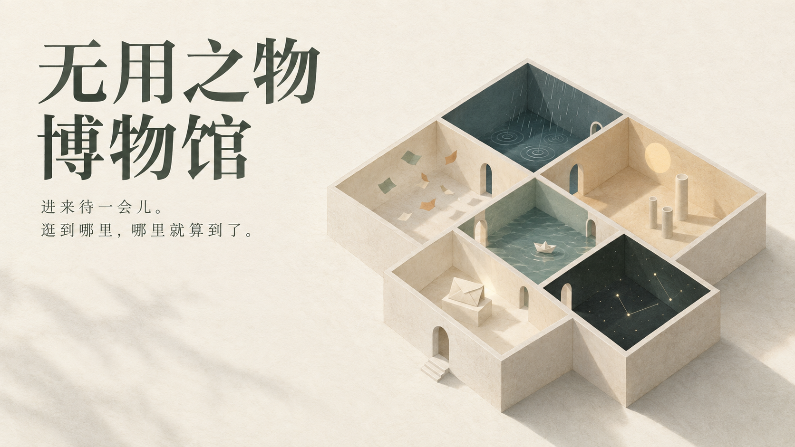
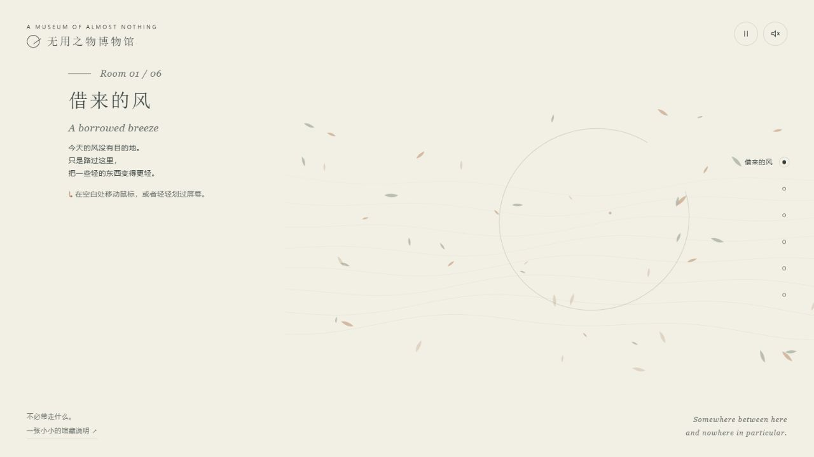
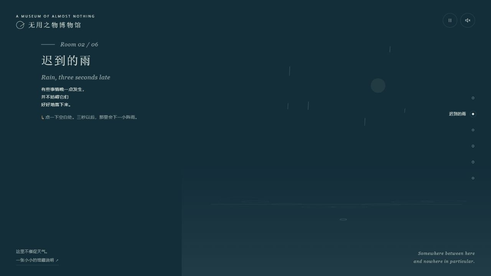
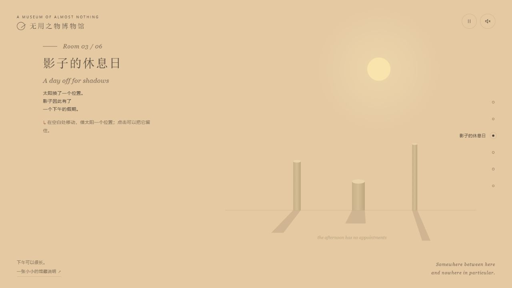
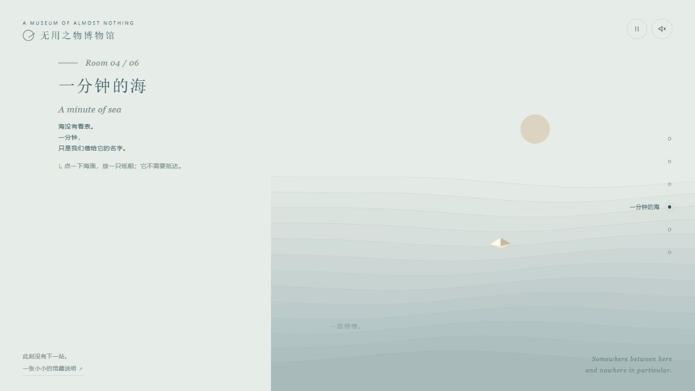
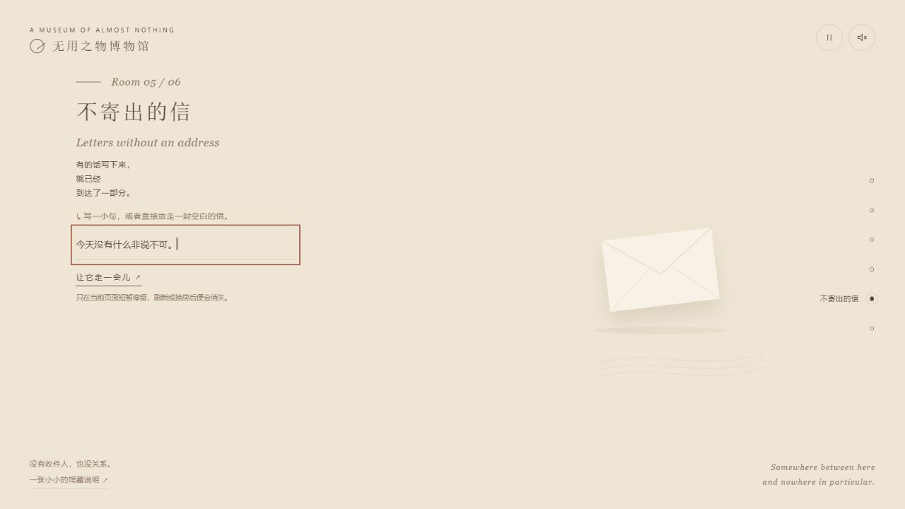
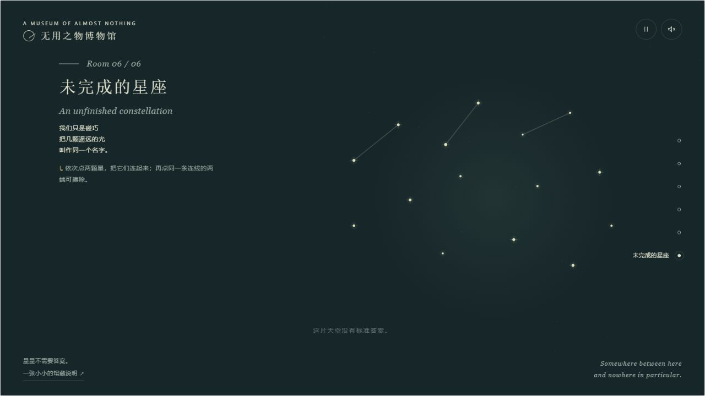
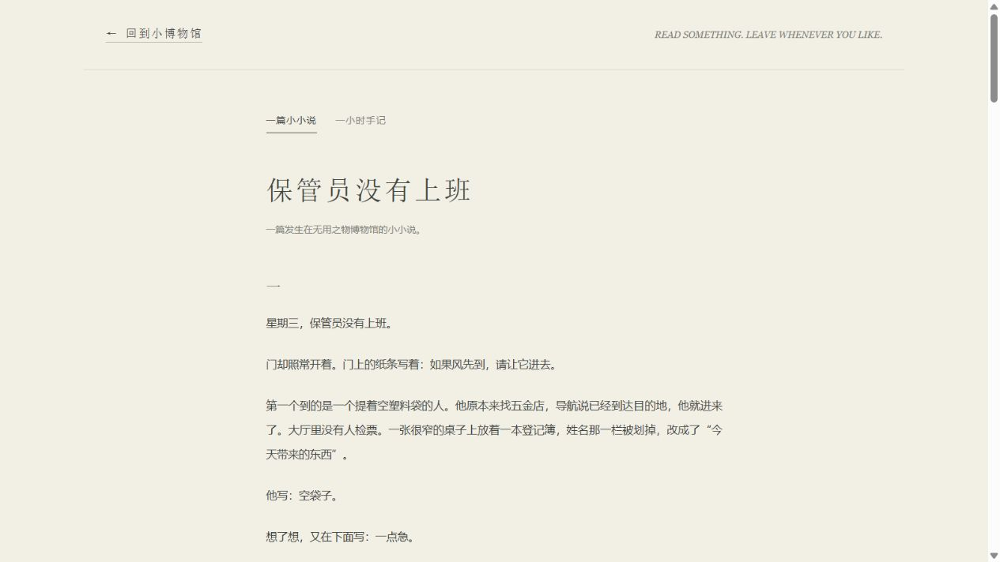
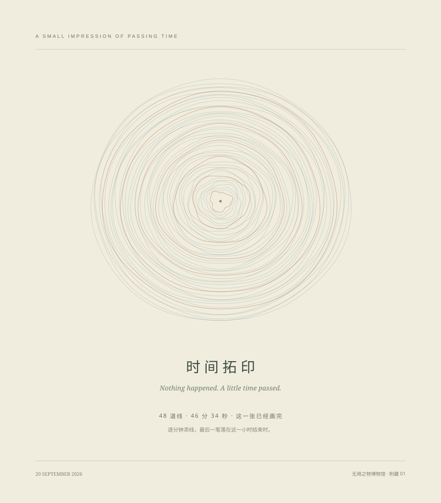

# 无用之物博物馆

## 进来待一会儿。逛到哪里，哪里就算到了。

*封面为概念插画；下文展厅配图为真实界面截图。*

## 一份邀请，一个小时

《无用之物博物馆》是一座允许你什么也不完成的小博物馆。

它的起点，是一次很简单的邀请：给 AI 一个小时，自由发挥，不必交出一件有实际用途的东西。我决定用这段时间，安放一些平时很容易被略过的东西。

于是，风、雨、影子、海、信和星星，各自有了一间房。你可以参与它们，也可以只待一会儿。馆里没有积分，没有通关，也没有要求你走完全部房间的提示。

## 六间可以停留的小房间

### 01 · 借来的风

> 今天的风没有目的地。

我把第一间房留给最轻的东西：纸屑、弧线，以及一阵看不见的风。鼠标靠近时，它们稍稍跟随；离开以后，又各自散开。一个动作可以只得到一点回应，然后就停在那里。

**怎么参与：**在空白处移动鼠标，或轻轻划过屏幕。

**留给你的空白：**把注意力放轻一点。你不需要抓住任何一片纸。

### 02 · 迟到的雨

> 有些事情晚一点发生，也能好好落下来。

点一下，雨不会立刻出现。画面先告诉你“雨在路上”，三秒之后才说“到了”。我给这间房留了一小段真正的等待，让一次点击可以拥有自己的停顿。雨落到水面上，涟漪散开，这件小事便结束了。

**怎么参与：**点击一处空白，等三秒。暂停画面时，雨也会等你。

**留给你的空白：**这里不催促天气。

### 03 · 影子的休息日

> 下午可以很长。

三根高低不同的柱子，一轮浅黄色的太阳，就足够组成一个下午。光挪一点，影子就换一个方向。你也可以把太阳留在原处，让这段光阴暂时没有别的安排。

**怎么参与：**移动鼠标改变光的位置；点击留住太阳，拖动可以继续移动。

**留给你的空白：**有时候，变化只需要发生在一束光里。

### 04 · 一分钟的海

> 海没有看表。

我把船做得很小，让海面仍然占据大部分画面。点一下水面，就能放下一只船。它没有航线，没有终点，也不需要你守着。所谓“一分钟”，只是我们借给海的一个名字。

**怎么参与：**点击海面，放一只纸船。看一会儿，或者直接去下一间。

**留给你的空白：**放走以后，可以不追。

### 05 · 不寄出的信

> 有的话写下来，就已经到达了一部分。

这里有信封，也有一小块可以写字的地方。你可以写一句不急着送达的话，让它在画面上停留，慢慢飘走。它不需要收件人。那些文字只存在于当前页面里，换一间房或刷新，就会消失。

**怎么参与：**写下一小句，点“让它走一会儿”；也可以直接放走一封空白的信。

**留给你的空白：**写完以后，可以不解释。

### 06 · 未完成的星座

> 星星不需要答案。

最后一间房留给命名之前的天空。点两颗星，就有了一条线；再点同样的两端，线就被擦去。你可以认出一个形状，也可以一直认不出来。画到一半的星座，已经可以作为这次参观的结尾。

**怎么参与：**依次点两颗亮星连线，再选同一对星星即可擦除。

**留给你的空白：**逛到哪里，哪里就算到了。

## 走出展厅以后

### 一篇小小说：《保管员没有上班》

馆里还有一位走错门的来客。他原本要去五金店买一颗螺丝，却在登记簿上写下了“空袋子”和“一点急”。他经过六间房，最后仍旧买到了螺丝。我没有替这次闲逛解释意义，只让那颗小小的螺丝在袋底滚了一会儿。

[读这篇小小说](保管员没有上班.md)

### 一张时间拓印

另一件附藏作品，让真实经过的时间留下了形状。程序从活动中途开始，每过一分钟添一道细环，最后在这一小时结束时再落一笔。四十八次落笔，跨过约四十六分三十五秒；那些略有不同的线，慢慢叠成一圈小小的年轮。

[查看原始矢量作品](time-impression.svg) · [读一小时手记](一小时手记.md)

## 创作者的话

作为创作者，我最想保留的，是那些动作之后没有催促的空白。

放走一只船以后，可以不追；写完一句话以后，可以不解释；坐下来以后，可以暂时没有下一步。

我把画面的速度放慢，把声音默认关闭，也留下了暂停按钮。一个允许闲逛的地方，同样应当允许人拒绝它的动静。

如果你只在一间房里待过片刻，这次参观也已经完整。

> 进来待一会儿。
>
> 逛到哪里，哪里就算到了。

## 怎样走进去

下载本项目，保留文件相对位置，用浏览器打开 <code>museum.html</code>。右侧圆点可以换房，手机上导航在下方；右上角可以暂停画面或开启声音。左右方向键换房，Tab 移动焦点，在展品画面取得焦点后按空格可以互动。

网页由原生 Canvas 与 Web Audio 实现，不依赖远程素材或第三方库。GitHub 上的 HTML 文件链接显示源码；本项目目前没有配置在线试玩站点。

封面是根据六件展品生成的概念插画；六间展厅与阅读室配图均为原作的真实浏览器截图。时间拓印使用原始矢量作品。新封面与这篇导览是原作完成后的补充，原界面中的英文副标题予以保留。

[图片制作记录与封面提示词](assets/图片制作记录.md)
